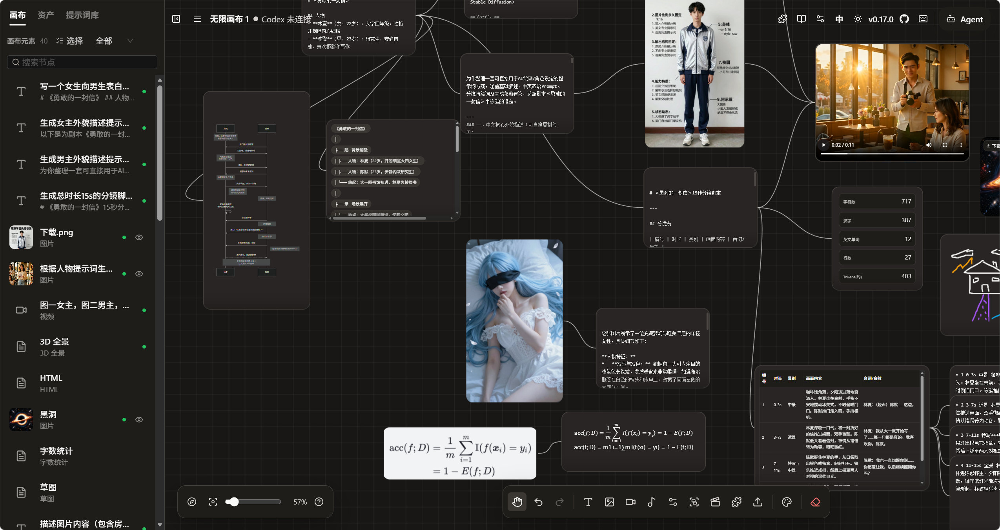
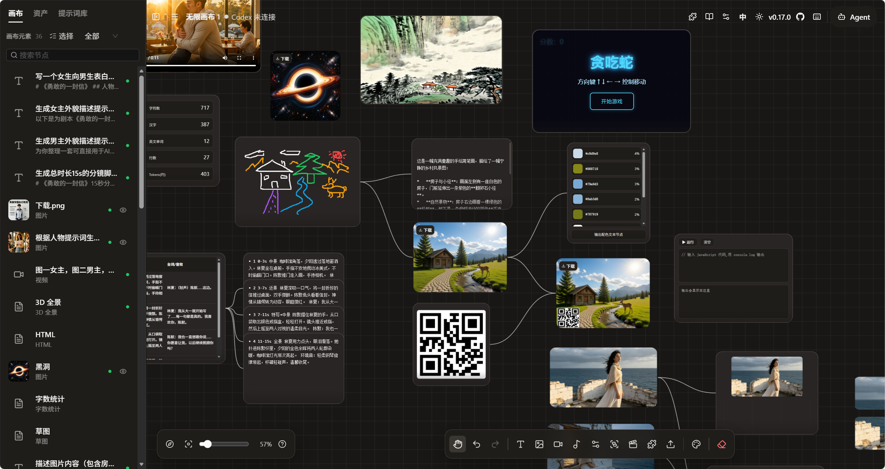
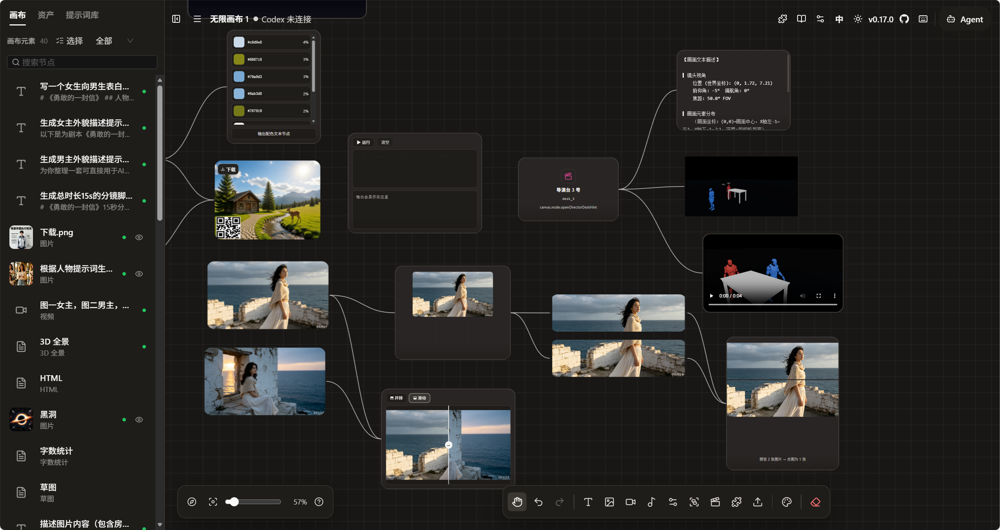
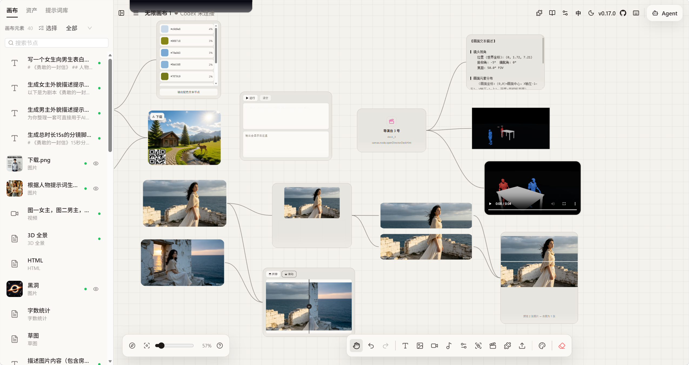
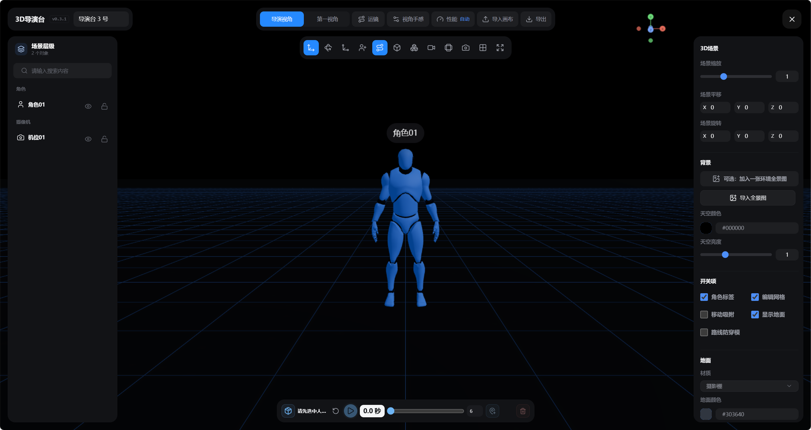
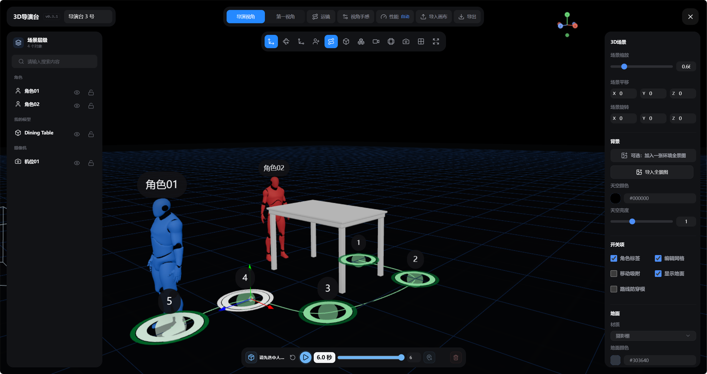
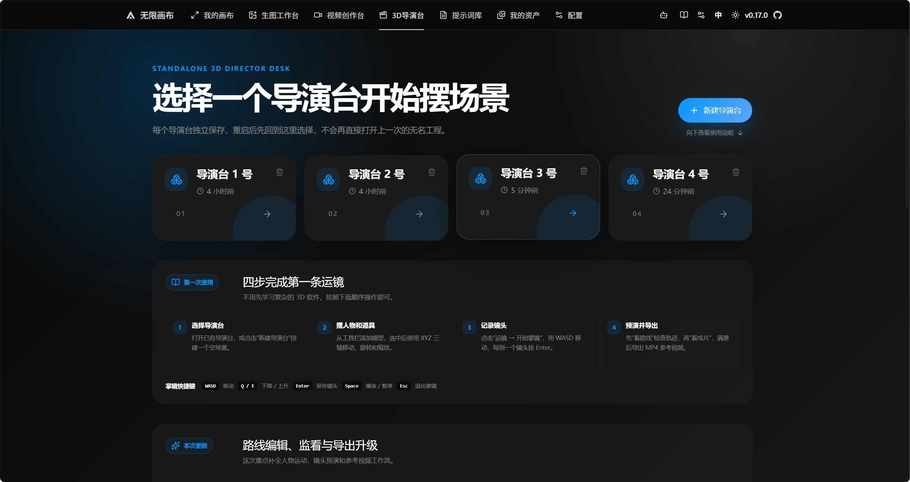
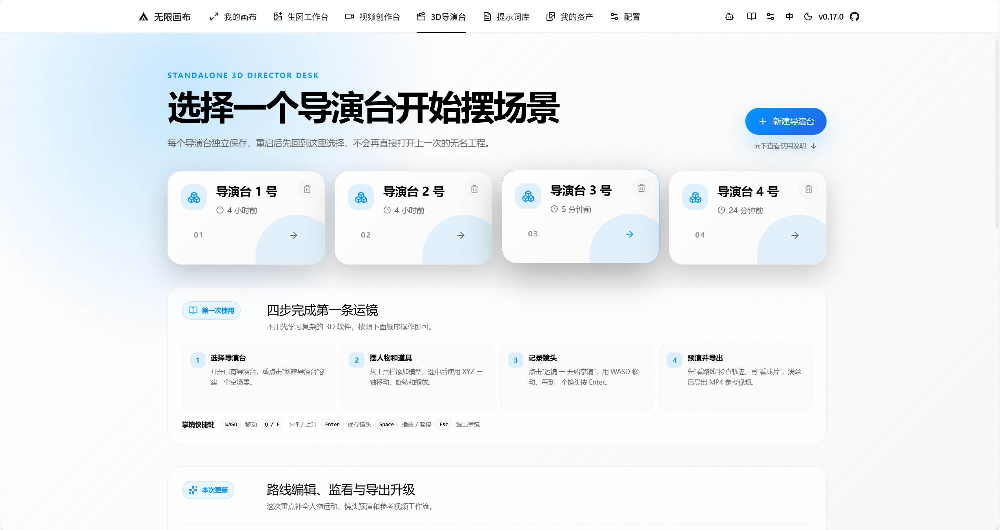

# Canvas Director

[简体中文](README_zh.md) · **English**


**Canvas Director** is a browser-based AI-assisted visual creation tool. It deeply integrates an **infinite 2D canvas** with a **3D director desk** through an iframe: write scripts and prompts on the canvas, block scenes and record camera moves in the 3D director desk, then hand the reference materials to AI for final image and video generation — the full short-drama / short-video creation pipeline in one place.

No backend is required. The browser connects directly to the OpenAI-compatible AI APIs you configure.

## Features

**Infinite Canvas**

- Pan and zoom an infinite canvas, with mini-map navigation, zoom slider and view reset.
- Three background styles (dot grid, grid lines, blank) with light and dark themes.
- Drag, resize, connect, copy and paste nodes; box select, multi-select, group and ungroup.
- Undo and redo for nodes, connections, viewport, background and assistant sessions.
- Double-click empty space to create a node; full keyboard shortcut support.

**AI Creation**

- Text-to-image, image-to-image / reference editing, and mask-based inpainting.
- Text-to-video, image-to-video and keyframe animation; audio generation; LLM chat with image understanding.
- Works with any OpenAI-compatible provider; custom call scripts can adapt to relay services and self-hosted endpoints.
- `@`-mention connected resources inside prompts (image references show real thumbnails); batch generation with image-group cards and alternate results.
- Video tasks persist their remote task ID: status polling continues after a page refresh, and failed steps can be retried from the failure point.

**Canvas Agent**

- Connects to a local Codex CLI through MCP and operates the canvas with streaming responses.
- Approval and permission control; connection token passed via URL fragment and sensitive credentials redacted from logs.

**3D Director Desk**

- Embedded inside the canvas via iframe and `postMessage`, with independently managed director workspaces.
- Built-in character and prop model library (local Guo / Mixamo assets) for scene blocking.
- First-person camera operation, camera trajectory recording and dual timeline.
- Export clean reference screenshots and H.264 MP4 videos back to the canvas.

**Plugin System**

- 18+ built-in node plugins: Markdown, SVG, HTML, 360° panorama, sticky note, Mermaid chart, LaTeX formula, code runner, JSON table, mind map, QR code, color palette, sketch, image split / combine / compare, audio waveform trimming and more.
- Install, update and uninstall remote plugins by URL; one-click install from the official plugin registry.
- TypeScript plugin SDK for building custom node types with AI generation and panel extensions.

**Local-First Data**

- Canvas projects and assets are stored in the browser (IndexedDB via localforage).
- Optional WebDAV synchronization across devices.
- API keys are stored in the browser and requests go directly to OpenAI-compatible endpoints.
- Optional local proxy to resolve CORS restrictions and relay requests.

## Workflow

1. Write scripts, prompts and character settings in canvas nodes.
2. Open the embedded 3D Director Desk to position characters, props and scenes.
3. Record camera trajectories and export reference screenshots with shot parameters.
4. Send the previsualization assets back to canvas nodes via `postMessage`.
5. The canvas sends the references to AI models for final image / video generation.
6. Results return to the canvas for continued iteration and organization.

## Screenshots

**Infinite Canvas**

<p>
  
  
</p>
<p>
  
  
</p>

**3D Director Desk**

<p>
  
  
</p>
<p>
  
  
</p>

## Quick Start

### Online Deployment

Deploy to [Vercel](https://vercel.com) or [Render](https://render.com) with zero configuration (`vercel.json` / `render.yaml` included). No backend is required — the browser connects directly to AI APIs.

### Local Development

```bash
# Clone
git clone https://github.com/Haitang-Hub/Canvas-Director.git
cd Canvas-Director

# Start the frontend (http://localhost:5070)
cd web && npm install && npm run dev

# Start the docs site (optional, http://localhost:3000)
cd ../docs && npm install && npm run dev
```

### Local Canvas Agent (Optional)

Provides a local Codex CLI that operates the canvas through MCP:

```bash
npx -y @basketikun/canvas-agent@latest
# http://localhost:17371
```

### Local Proxy (Optional)

A pure forwarding proxy that resolves browser CORS restrictions:

```bash
npx @basketikun/canvas-proxy@latest --port 23210
# http://localhost:23210
```

### Docker (Optional)

```bash
docker-compose up -d
```

## Tech Stack

| Category | Technology |
| --- | --- |
| Frontend framework | React 19 + TypeScript 5 |
| Build tool | Vite 7 |
| UI components | Ant Design 6 + Tailwind CSS v4 |
| State management | Zustand 5 (persisted with localforage) |
| 3D rendering | Three.js 0.184 + React Three Fiber 9 |
| Agent runtime | Node.js ≥ 18 + @openai/codex |
| Local proxy | Pure Node.js (CORS forwarding) |

## Documentation

The full documentation index is at [docs/index.md](docs/index.md). Key documents:

| Document | Description |
| --- | --- |
| [Quick Start](docs/content/docs/overview/quick-start.mdx) | Installation, configuration and getting started |
| [Features](docs/content/docs/overview/features.mdx) | Complete feature descriptions |
| [Canvas Node Guide](docs/content/docs/canvas/canvas-node-manual.mdx) | Node type usage reference |
| [Canvas Shortcuts](docs/content/docs/canvas/canvas-shortcuts.mdx) | Keyboard shortcut reference |
| [Local Development](docs/content/docs/development/local-development.mdx) | Debugging and build instructions |
| [Docker Deployment](docs/content/docs/overview/docker.mdx) | Containerized deployment |
| [Agent Connection](docs/content/docs/development/local-codex-canvas.mdx) | Codex Agent integration |
| [Security](docs/content/docs/support/security.mdx) | Security model and vulnerability reporting |

## Data & Security

- Canvas projects and the asset library are primarily stored in the browser locally; there is no built-in cloud sync. WebDAV can be configured for cross-device synchronization.
- AI API keys are stored in the browser. The frontend sends requests directly to the OpenAI-compatible endpoints you configure — please use keys from trusted providers.
- The optional Canvas Agent runs locally on your own machine and uses token-based authentication.

## Acknowledgments

Canvas Director is a secondary development. Its core capabilities originate from:

- [Infinite Canvas](https://github.com/basketikun/infinite-canvas)
- [3D Director Desk](https://github.com/xiaozangao/3d-director-desk)

## License

[MIT](LICENSE)
